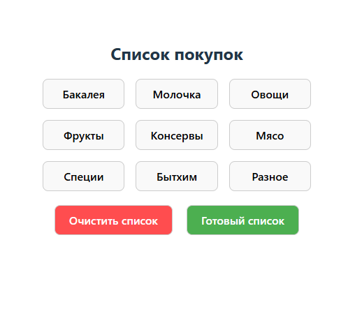
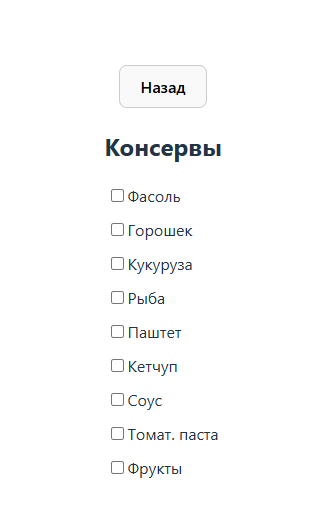
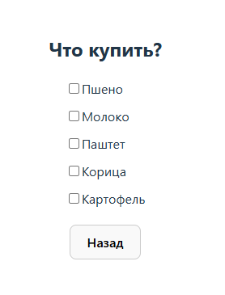

# Shopping List App

React-приложение для создания списка покупок. Вы можете выбирать продукты из различных категорий, сохранять их, а также отправлять данные на сервер.

---

## Скриншоты





---

## Стек технологий

- **React**
- **TypeScript**
- **React Query**
- **JSON Server**

---

## Установка

```bash
## Клонирование репозитория
git clone https://github.com/ваш-проект.git

## Установка зависимостей
cd shopping-list
npm install

## Запуск JSON Server
npx json-server --watch db.json --port 3000

## Локальный запуск production-версии
npm preview
```

## API

- `GET /categories` — получить список категорий
- `GET /selectedProducts` — получить выбранные продукты
- `POST /selectedProducts` — добавить продукт в список
- `DELETE /selectedProducts/:id` — удалить продукт

---

## Основные возможности

- Просмотр списка категорий продуктов
- Выбор продуктов в каждой категории
- Сохранение списка выбранных продуктов
- Очистка списка продуктов

---

## Структура проекта

```
src/
├── components/         # Компоненты React
│   ├── CategoriesList  # Список категорий
│   ├── FinalList       # Финальный список
│   └── ProductList     # Список продуктов
├── hooks/              # Кастомные хуки
├── App.tsx             # Главный компонент приложения
├── index.tsx           # Точка входа приложения
└── db.json             # Файл JSON Server
```

---

## Будущие улучшения

- Добавить авторизацию пользователей
- Подключить базу данных вместо JSON Server
- Расширить возможности по сортировке и фильтрации продуктов
- Добавить возможность делиться списком с другими пользователями

---

## Контакты

- GitHub: [мой профиль](https://github.com/OllgaKharina)
- Email: olxarina@yandex.ru
